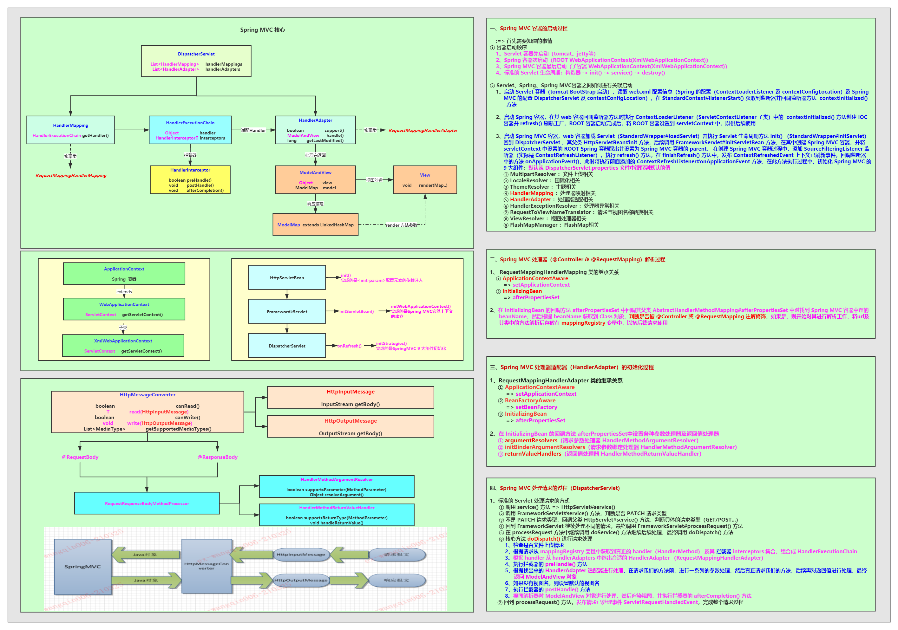
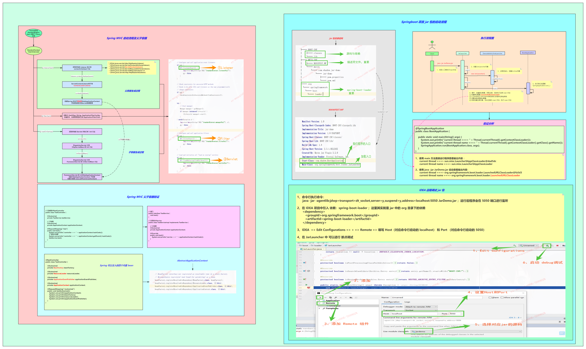

# Spring MVC 工程简介
### 一、Spring MVC 核心源码解读
> 在 Spring 源码的基础上，继续解读其扩展的 Spring MVC 的原理,
> 按理说，我们需要先掌握 Web 容器 Tomcat 相关的原理，但是我们知道
> Tomcat 其实就是一个 Servlet 容器，因此，我们只需要大概知道 Servlet 相关的内容即可

**1、Servlet 生命周期**
* Servlet 构造器 ：Servlet 实例化
* **<font color=red>init()</font>**  ：Servlet 容器启动时会回调的方法
* **<font color=red>service()</font>** ：请求到达时首先处理的方法
* destroy() ：Servlet 销毁时回调的方法

**2、Spring MVC 核心 <font color=red>DispatcherServlet</font> 的继承关系依次往下**
* HttpServlet > init() 、service()、destroy() 、doGet...Servlet 规范
* <font color=red>HttpServletBean </font> > 针对 <font color=red>init()</font> 方法做了重写，并提供了模板方法 initServletBean()
* <font color=red>FrameworkServlet </font> > 针对其父类（HttpServletBean）的模板方法 <font color=red>initServletBean() 做了实现，里面创建 Spring MVC 容器</font>
* <font color=red>DispatcherServlet</font> > 核心方法 <font color=red>doDispatch()</font> 处理请求

**3、<font color=red>ContextLoaderListener</font> 的使命**
> 其是 ServletContextListener 的子类，其提供了两个核心方法 **<font color=blue>contextInitialized()</font>** 、contextDestroyed()
> 在 Servlet 容器启动过程中，在所有的 filters 和 servlets 初始化之前会回调其中的 contextInitialized() 方法 
* <font color=blue>contextInitialized()</font> ：Servlet 容器启动后（所有的 filters 和 servlets 初始化之前）回调
* contextDestroyed() ：Servlet 容器销毁前（所有的 filters 和 servlets 销毁之后）回调


**4、Servlet 容器、Spring 容器、Spring MVC 容器的启动顺序**
* **<font color=red>Servlet 容器先启动（Tomcat、Jetty等）</font>**
* **<font color=red>Spring 容器次启动</font>**（ROOT WebApplicationContext -> XmlWebApplicationContext）
* **<font color=red>Spring MVC 容器最后启动</font>**（子容器，WebApplicationContext -> XmlWebApplicationContext）
> Spring MVC 的父容器是 Spring 容器

**5、三种容器是如何关联启动的**
* 启动 Servlet 容器，读取 web.xml 文件的配置信息，Spring 的配置 ContextLoaderListener、contextConfigLocation
  及 Spring MVC 的配置 DispatcherServlet、contextConfigLocation，然后在 Tomcat StandardContext#listenerStart() 获取到监听器
  并回调监听器方法 <font color=blue>contextInitialized()</font>

* 启动 Spring 容器，在 Web 容器回调监听器方法执行 <font color=red>ContextLoaderListener#contextInitialized()</font> 方法，在这个过程中 创建 Spring IOC 容器，
  并 refresh() 刷新工厂，ROOT 容器启动完成后，将 ROOT 容器设置到 servletContext 中，以供后续使用
  
* 启动 Spring MVC 容器，在 Web 容器加载 Servlet（Tomcat StandardWrapper#loadServlet()） 实例化后调用去 <font color=red>init()</font> 方法（StandardWrapper#initServlet()），
  这里将会执行 DispatcherServlet （及其父类）的相关方法，在此调用过程中创建 Spring MVC 容器，并将前面设置到 servletContext 中的 ROOT 容器设置其 parent，
  在创建Spring MVC 容器的过程中，添加了一个 SourceFilteringListener监听器（实际是 ContextRefreshListener）,再次调用 refresh() 方法刷新工厂，
  在其 finishRefresh() 方法中，发布 ContextRefreshedEvent 上下文已刷新事件，此事件将被前面添加的监听器监听到，然后执行其 <font color=red>ContextRefreshListener#onApplicationEvent()</font> 方法，
  在此监听器方法中，将完成 Spring MVC 九大组件的初始化工作：默认从 DispatcherServlet.properties 文件中读取默认值
  ① MultipartResolver ：文件上传相关
  ② LocaleResolver ：国际化相关
  ③ ThemeResolver ：主体相关
  ④ **<font color=green>HandlerMapping</font>** ：处理器映射相关
  ⑤ **<font color=green>HandlerAdapter</font>** ：处理器适配相关
  ⑥ HandlerExceptionResolver ：处理器异常相关
  ⑦ RequestToViewNameTranslator ：请求与视图名称转换相关
  ⑧ ViewResolver ：视图处理器相关
  ⑨ FlashMapManager ：FlashMap相关


**6、<font color=blue>HandlerMapping 之 RequestMappingHandlerMapping 的解析过程</font>**
* RequestMappingHandlerMapping 的继承关系
> ① ApplicationContextAware -> setApplicationContext()

> ② InitializingBean -> <font color=blue>afterPropertiesSet()</font>
* 解析 @Controller 与 @RequestMapping 的过程
> <font color=blue>在 InitializingBean 的回调方法 afterPropertiesSet() 中回调其父类的 super.afterPropertiesSet() 方法，找到 Spring MVC 容器中存的 beanName，然后根据
> beanName 获取到 Class 对象，判断是否被 @Controller 或 @RequestMapping 注解修饰，如果是，则开始对其进行解析工作，将 url 与其类中的方法解析后存放在
> mappingRegistry 变量中，以备胡须请求使用</font>

**7、<font color=green>HandlerAdapter 之 RequestMappingHandlerAdapter 的初始化过程</font>**
* RequestMappingHandlerAdapter 的继承关系
> ① ApplicationContextAware -> setApplicationContext()

> ② BeanFactory -> setBeanFactory()

> ③ InitializingBean -> <font color=green>afterPropertiesSet()</font>
* 在 InitializingBean 的回调方法 afterPropertiesSet() 中设置各种请求参数处理器及返回值处理器
> ① argumentResolvers （请求参数处理器 HandlerMethodArgumentResolver）

> ② iniBinderArgumentResolvers （请求参数绑定器 HandlerMethodArgumentResolver）

> ③ returnValueHandlers（返回值处理器 HandlerMethodReturnValueHandler）


**8、Spring MVC 处理请求的过程（DispatcherServlet）**
> 标准的 Servlet 处理请求的方式 
      ① 调用 service() 方法 => HttpServlet#service()

>      ② 调用 FrameworkServlet#service() 方法，判断是否 PATCH 请求类型

>      ③ 不是 PATCH 请求类型，回调父类 HttpServlet#service() 方法，判断具体的请求类型（GET/POST...）

>      ④ 回到 FrameworkServlet 继续处理不同的请求，最终调用 FrameworkServlet#processRequest() 方法

>      ⑤ 在 processRequest 方法中继续调用 doService() 方法继续后续处理，最终调用 doDispatch() 方法

>      ⑥ 核心方法 doDispatch() 进行请求处理

>>          1、检查是否文件上传请求

>>          2、根据请求从 mappingRegistry 变量中获取到真正的 handler（HandlerMethod） 及其 拦截器 interceptors 集合，组合成 HandlerExecutionChain 

>>          3、根据 handler 从 handlerAdapters 中选出合适的 HandlerAdapter （RequestMappingHandlerAdapter）

>>          4、执行拦截器的 preHandle() 方法

>>          5、根据找出来的 HandlerAdapter 适配器进行处理，在请求我们的方法前，进行一系列的参数处理，然后真正请求我们的方法，后续再对返回值进行处理，最终返回 ModelAndView 对象

>>          6、如果没有视图名，则设置默认的视图名

>>          7、执行拦截器的 postHandle() 方法

>>          8、视图解析器对 ModelAndView 对象进行处理，然后渲染视图，并执行拦截器的 afterCompletion() 方法

>     ⑦ 回到 processRequest() 方法，发布请求已处理事件 ServletRequestHandledEvent，完成整个请求过程

**9、总结图**

  

  


### 三、Spring MVC 项目配置
#### 1、xml 版本
**1、配置 web.xml**
```xml
<?xml version="1.0" encoding="UTF-8"?>
<web-app xmlns:xsi="http://www.w3.org/2001/XMLSchema-instance"
         xmlns="http://java.sun.com/xml/ns/javaee"
         xmlns:web="http://java.sun.com/xml/ns/javaee/web-app_2_5.xsd"
         xsi:schemaLocation="http://java.sun.com/xml/ns/javaee
         http://java.sun.com/xml/ns/javaee/web-app_2_5.xsd"
         id="WebApp_ID" version="2.5">

    <!-- spring 容器的配置信息 -->
    <context-param>
        <param-name>contextConfigLocation</param-name>
        <param-value>classpath*:spring.xml</param-value>
    </context-param>
    <listener>
        <listener-class>org.springframework.web.context.ContextLoaderListener</listener-class>
    </listener>

    <!-- spring mvc 容器配置信息 -->
    <servlet>
        <servlet-name>dispatcherServlet</servlet-name>
        <servlet-class>org.springframework.web.servlet.DispatcherServlet</servlet-class>
        <init-param>
            <param-name>contextConfigLocation</param-name>
            <param-value>classpath*:spring-mvc.xml</param-value>
        </init-param>
    </servlet>
    <servlet-mapping>
        <servlet-name>dispatcherServlet</servlet-name>
        <url-pattern>/</url-pattern>
    </servlet-mapping>

</web-app>
```
**2、配置 Spring 的配置 spring.xml** 
```xml
<?xml version="1.0" encoding="UTF-8"?>
<beans xmlns="http://www.springframework.org/schema/beans"
       xmlns:context="http://www.springframework.org/schema/context"
       xmlns:xsi="http://www.w3.org/2001/XMLSchema-instance"
       xsi:schemaLocation="http://www.springframework.org/schema/beans
       http://www.springframework.org/schema/beans/spring-beans.xsd
       http://www.springframework.org/schema/context
       http://www.springframework.org/schema/context/spring-context.xsd">

    <!-- spring 扫描包 -->
    <context:component-scan base-package="com.shadow.application">
        <context:exclude-filter type="annotation" expression="org.springframework.stereotype.Controller"/>
    </context:component-scan>

</beans>
```
**3、配置 Spring MVC 的配置 spring-mvc.xml**
```xml
<?xml version="1.0" encoding="UTF-8"?>
<beans xmlns="http://www.springframework.org/schema/beans"
       xmlns:context="http://www.springframework.org/schema/context"
       xmlns:mvc ="http://www.springframework.org/schema/mvc"
       xmlns:xsi="http://www.w3.org/2001/XMLSchema-instance"
       xsi:schemaLocation="http://www.springframework.org/schema/beans
       http://www.springframework.org/schema/beans/spring-beans.xsd
       http://www.springframework.org/schema/context
       http://www.springframework.org/schema/context/spring-context.xsd
       http://www.springframework.org/schema/mvc
       http://www.springframework.org/schema/mvc/spring-mvc.xsd">

    <!-- spring mvc 扫描包 -->
    <context:component-scan base-package="com.shadow.application.controller" />

    <!-- enable-matrix-variables="true" 支持 @MatrixVariable -->
    <mvc:annotation-driven enable-matrix-variables="true">
        <mvc:message-converters> <!-- 消息转换器 -->
            <bean class="org.springframework.http.converter.json.MappingJackson2HttpMessageConverter"/>
        </mvc:message-converters>
    </mvc:annotation-driven>

    <!-- 拦截器配置 -->
    <mvc:interceptors>
        <bean class="com.shadow.application.interceptor.TestInterceptor" />
        <bean class="com.shadow.application.interceptor.LoginInterceptor" />
    </mvc:interceptors>

    <!-- 配置监听器 -->
    <bean class="com.shadow.application.listener.RequestEndListener" />

    <!-- 视图处理器 -->
    <mvc:view-resolvers>
        <bean class="org.springframework.web.servlet.view.InternalResourceViewResolver">
            <property name="prefix" value="/WEN-INF/jsps/" />
            <property name="suffix" value=".jsp" />
        </bean>
    </mvc:view-resolvers>

    <!-- 文件上传配置 -->
    <bean id="multipartResolver"
          class="org.springframework.web.multipart.commons.CommonsMultipartResolver">
        <!--上传文件的最大大小，单位为字节 -->
        <property name="maxUploadSize" value="17367648787"></property>
        <!-- 上传文件的编码 -->
        <property name="defaultEncoding" value="UTF-8"></property>
    </bean>
</beans>
```

#### 2、javaConfig 版本
**1、配置 web.xml **
```xml
<?xml version="1.0" encoding="UTF-8"?>
<web-app xmlns:xsi="http://www.w3.org/2001/XMLSchema-instance"
         xmlns="http://java.sun.com/xml/ns/javaee"
         xmlns:web="http://java.sun.com/xml/ns/javaee/web-app_2_5.xsd"
         xsi:schemaLocation="http://java.sun.com/xml/ns/javaee
         http://java.sun.com/xml/ns/javaee/web-app_2_5.xsd"
         id="WebApp_ID" version="2.5">

    <!-- spring 容器的配置信息 -->
    <context-param>
        <param-name>contextConfigLocation</param-name>
        <param-value>classpath*:spring.xml</param-value>
    </context-param>
    <listener>
        <listener-class>org.springframework.web.context.ContextLoaderListener</listener-class>
    </listener>
</web-app>
```
**2、编写 MvcConfig.java **
```java
@EnableWebMvc
@Configuration
@ComponentScan("com.shadow.application")
public class MvcConfig implements WebMvcConfigurer {

    /**
     * 添加拦截器
     */
    @Override
    public void addInterceptors(InterceptorRegistry registry) {
        registry.addInterceptor(new TestInterceptor());
        registry.addInterceptor(new LoginInterceptor());
    }

    /**
     * 添加消息转换器
     */
    @Override
    public void extendMessageConverters(List<HttpMessageConverter<?>> converters) {
        converters.add(new MappingJackson2HttpMessageConverter());
    }

    /**
     * 类似 <annotation-driven enable-matrix-variables = "true" />
     * pathHelper.setRemoveSemicolonContent(false)
     * 支持 @MatrixVariable 注解
     */
    @Override
    public void configurePathMatch(PathMatchConfigurer configurer) {
        UrlPathHelper pathHelper = new UrlPathHelper();
        pathHelper.setRemoveSemicolonContent(false);
        configurer.setUrlPathHelper(pathHelper);
    }


    /**
     * 文件上传配置
     */
    @Bean
    public MultipartResolver multipartResolver() {
        CommonsMultipartResolver multipartResolver = new CommonsMultipartResolver();
        multipartResolver.setMaxUploadSize(17367648787L);
        multipartResolver.setDefaultEncoding("UTF-8");
        return multipartResolver;
    }


    /**
     * 视图解析器
     */
    @Bean
    public ViewResolver viewResolver() {
        InternalResourceViewResolver viewResolver = new InternalResourceViewResolver();
        viewResolver.setPrefix("/WEN-INF/jsps/");
        viewResolver.setSuffix(".jsp");
        viewResolver.setExposeContextBeansAsAttributes(true);
        return viewResolver;
    }
}
```
**3、编写 AbstractAnnotationConfigDispatcherServletInitializer 子类**
```java
public class ApplicationInitializer extends AbstractAnnotationConfigDispatcherServletInitializer {

    // spring javaConfig 这里默认使用 web.xml 中的配置
    @Override
    protected Class<?>[] getRootConfigClasses() {
        return new Class[0];
    }

    // spring mvc javaConfig
    @Override
    protected Class<?>[] getServletConfigClasses() {
        return new Class[]{MvcConfig.class};
    }

    @Override
    protected String[] getServletMappings() {
        return new String[]{"/"};
    }
}
```

### 四、Spring MVC 常用注解的使用
```java
@Controller
@RequestMapping
@ResponseBody
public class TestController {

    @Autowired
    private ApplicationContext applicationContext;

    @Autowired
    private TestService testService;

    @GetMapping("/save")
    @ResponseBody
    public R save() {
        ConsolePrinter.printlnCyan("controller 所属容器：" + this.applicationContext.hashCode());
        ConsolePrinter.printlnCyan("controller 所属容器父容器：" + this.applicationContext.getParent().hashCode());
        User user = new User();
        user.setName("王钦")
            .setPassword("1111")
            .setEmail("438111969@qq.com")
            .setPhone("110")
            .setAddress("湖南省-张家界市");
        testService.save(user);
        return R.ok().put("data","保存成功");
    }


    /**
     * 路径传参
     * @PathVariable 注解
     * /path/variable/shadow/18
     * name = shadow
     * age = 18
     */
    @GetMapping("/path/variable/{name}/{age}")
    public R pathVariable(@PathVariable("name") String name,@PathVariable("age")int age) {
        ConsolePrinter.printlnRed("@PathVariable params : " + name + " " + age);
        return R.ok().put("data",name + " " + age);
    }

    /**
     * 路径传参
     * @MatrixVariable 注解
     * /matrix/variable/shadow;q=18;email=438111969@qq.com
     * name = shadow
     * age = 18
     * email = 438111969@qq.com
     */
    @GetMapping("/matrix/variable/{name}")
    public R matrixVariable(@PathVariable("name")String name
            , @MatrixVariable("age")int age
            ,@MatrixVariable("email")String email) {
        ConsolePrinter.printlnYellow("@MatrixVariable params : " + name + " " + age + " " + email);
        return R.ok().put("data",name + " " + age + " " + email);
    }


    /**
     * 获取请求参数
     * @RequestParam
     * /request/param?name=shadow&age=18
     * name = shadow
     * age = 18
     */
    @GetMapping("/request/param")
    public R requestParam(@RequestParam("name")String name,@RequestParam("age")int age) {
        ConsolePrinter.printlnPurple("@RequestParam params : " + name + " " + age);
        return R.ok().put("data",name + " " + age);
    }


    /**
     * 获取请求头信息
     * @RequestHeader
     * /request/header
     * encoding = gzip, deflate, br
     * connection = keep-alive
     */
    @GetMapping("/request/header")
    public R requestHeader(@RequestHeader("Accept-Encoding")String encoding
                    ,@RequestHeader("Connection")String connection) {
        ConsolePrinter.printlnCyan("@RequestHeader params : " + encoding + " " + connection);
        return R.ok().put("data", encoding + " " + connection);
    }


    /**
     * 获取 Cookie 信息
     * @CookieValue
     * /cookie/value
     * jsessionId = xxxx
     */
    @GetMapping("/cookie/value")
    public R cookieValue(@CookieValue("JSESSIONID")String jsessionId) {
        ConsolePrinter.printlnRed("@CookieValue params : " + jsessionId);
        return R.ok().put("data",jsessionId);
    }


    /**
     * 获取前端传递的信息映射为对象
     * @ModelAttribute
     * /model/attribute?name=shadow&age=18&email=438111969@qq.com
     * User(name=shadow, age=18, password=null, email=438111969@qq, phone=null, address=null)
     */
    @GetMapping("/model/attribute")
    public R modelAttributeGet(@ModelAttribute User user) {
        ConsolePrinter.printlnYellow("@ModelAttribute get params : " + user);
        return R.ok().put("data", user);
    }
    /**
     * 获取前端传递的信息映射为对象
     * @ModelAttribute
     * /model/attribute
     * {
     *     "name":"shadow",
     *     "age":18,
     *     "email":"438111969@qq.com"
     * }
     * User(name=shadow, age=18, password=null, email=438111969@qq, phone=null, address=null)
     */
    @PostMapping("/model/attribute")
    public R modelAttributePost(@ModelAttribute User user) {
        ConsolePrinter.printlnPurple("@ModelAttribute post params : " + user);
        return R.ok().put("data", user);
    }

    /**
     * 获取 session.setAttribute 设置的属性值
     * @SessionAttribute
     * /session/attribute
     * request.getSession().setAttribute("login_user",new User()) 拦截器设置
     * @see com.shadow.application.interceptor.LoginInterceptor
     */
    @GetMapping("/session/attribute")
    public R sessionAttribute(@SessionAttribute("login_user") User user) {
        ConsolePrinter.printlnCyan("@SessionAttribute params : " + user);
        return R.ok().put("data",user);
    }

    /**
     * 获取 request.setAttribute 设置的属性值
     * @RequestAttribute
     * /request/attribute
     * request.setAttribute("user",new User()) 拦截器设置
     * @see com.shadow.application.interceptor.LoginInterceptor
     */
    @GetMapping("/request/attribute")
    public R requestAttribute(@RequestAttribute("user") User user) {
        ConsolePrinter.printlnRed("@RequestAttribute params : " + user);
        return R.ok().put("data",user);
    }


    // ================== POST 请求 ======================

    /**
     * 文件上传请求
     * /multipart/upload
     * MultipartFile
     * <dependency>
     * 		<groupId>commons-fileupload</groupId>
     * 		<artifactId>commons-fileupload</artifactId>
     * 	</dependency>
     *
     * 	<bean id="multipartResolver"
     * 	class="org.springframework.web.multipart.commons.CommonsMultipartResolver">
     * 	<!--上传文件的最大大小，单位为字节 -->
     * 	<property name="maxUploadSize" value="17367648787"></property>
     *
     * 	<!-- 上传文件的编码 -->
     * 	<property name="defaultEncoding" value="UTF-8"></property>
     * </bean>
     */
    @PostMapping("/multipart/upload")
    public R multipart(@RequestParam("file")MultipartFile file) {
        ConsolePrinter.printlnYellow("multipart file upload params : " + file.getOriginalFilename());
        return R.ok().put("data",file.getOriginalFilename());
    }


    /**
     * 请求体映射对象
     * @RequestBody
     * /request/body
     * {
     *     "name":"shadow",
     *     "age":18,
     *     "email":"438111969@qq.com"
     * }
     * User(name=shadow, age=18, password=null, email=438111969@qq, phone=null, address=null)
     */
    @PostMapping("/request/body")
    public R requestBody(@RequestBody User user) {
        ConsolePrinter.printlnPurple("@RequestBody params : " + user);
        return R.ok().put("data",user);
    }

    /**
     * 请求体映射对象
     * HttpEntity<T>
     * /http/entity
     * {
     *     "name":"shadow",
     *     "age":18,
     *     "email":"438111969@qq.com"
     * }
     * User(name=shadow, age=18, password=null, email=438111969@qq, phone=null, address=null)
     */
    @PostMapping("/http/entity")
    public R httpEntity(HttpEntity<User> userHttpEntity) {
        ConsolePrinter.printlnCyan("HttpEntity params : " + userHttpEntity);
        return R.ok().put("data",userHttpEntity);
    }

}
```

### 五、拦截器的实现
```java
public class TestInterceptor extends HandlerInterceptorAdapter {
    @Override
    public boolean preHandle(HttpServletRequest request, HttpServletResponse response, Object handler) throws Exception {
        ConsolePrinter.printlnRed("TestInterceptor preHandle....");
        return true;
    }


    @Override
    public void postHandle(HttpServletRequest request, HttpServletResponse response, Object handler, ModelAndView modelAndView) throws Exception {
        ConsolePrinter.printlnPurple("TestInterceptor postHandle....");
    }

    @Override
    public void afterCompletion(HttpServletRequest request, HttpServletResponse response, Object handler, Exception ex) throws Exception {
        ConsolePrinter.printlnCyan("TestInterceptor afterCompletion....");
    }
}
```
### 六、监听器的实现
```java
public class RequestEndListener {

    @EventListener
    public void requested(RequestHandledEvent event) {
        ConsolePrinter.printlnCyan("请求处理完成监听器 SessionId ：" + event.getSessionId());
    }
}
```


### 七、Spring MVC 的扩展
